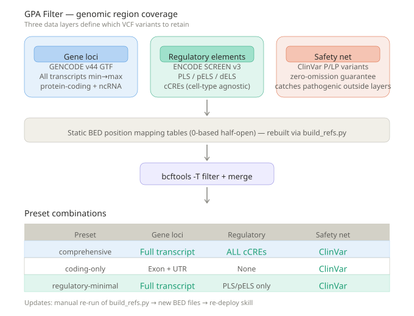

# dgra-prefilter

Genomic region prefilter for whole-genome VCF files based on GENCODE, ENCODE, and ClinVar.

## What it does

dgra-prefilter is a **static position mapping table** — it pre-defines which genomic regions are "interesting" so you can rapidly filter WGS VCF files to only those variants falling within biologically significant positions. It does NOT perform variant annotation; it simply keeps or discards variants based on their genomic coordinates.

The tool builds BED files from three data sources, then uses `bcftools -T` to filter VCF variants by position:



### Three data layers

| Layer | Source | What it covers |
|-------|--------|---------------|
| **Gene loci** | GENCODE v44 GTF | All transcript extents (min→max coordinates) for protein-coding genes and ncRNA |
| **Regulatory elements** | ENCODE SCREEN v3 | cCREs — promoter-like sequences (PLS), proximal/pDistal enhancer-like sequences (pELS/dELS) |
| **Safety net** | ClinVar | All pathogenic/likely pathogenic (P/LP) variants — guarantees zero omission of known pathogenic variants, even if they fall outside gene loci or regulatory regions |

### How it works

1. **Build phase** (`build_refs.py`): Downloads GENCODE GTF, ENCODE SCREEN BED, and ClinVar VCF → parses and converts each into sorted BED files → merges into preset-specific composite BED files
2. **Filter phase** (CLI/API): Loads the appropriate BED for your chosen preset → runs `bcftools view -T` for coordinate-based filtering → merges in ClinVar safety net hits
3. **Annotation phase** (optional): Adds `DGRA_REGION` (gene/ncrna/regulatory) and `DGRA_SAFETYNET` (ClinVar) INFO tags for downstream filtering

The BED reference files are **static** — once built, they don't change until you manually re-run `build_refs.py` with updated source data. No live API calls during filtering.

## Installation

```bash
pip install dgra-prefilter
```

## Usage

### CLI

```bash
dgra-prefilter \
  --input sample.vcf.gz \
  --output filtered.vcf.gz \
  --preset comprehensive
```

### Python API

```python
from dgra_prefilter import prefilter_vcf, annotate_vcf_file

# Default: filter only, no annotation (fastest)
result = prefilter_vcf(
    input_path="sample.vcf.gz",
    output_path="filtered.vcf.gz",
    preset="comprehensive",
)
print(f"Retained {result.stats.retained_variants}/{result.stats.input_variants} variants")

# Filter + annotate in one step
result = prefilter_vcf(
    input_path="sample.vcf.gz",
    output_path="filtered.vcf.gz",
    preset="comprehensive",
    annotate=True,
)

# Annotate an existing filtered VCF without re-running coordinate filtering
# (automatically detected if input already has DGRA tags)
result = annotate_vcf_file(
    input_path="already_filtered.vcf.gz",
    output_path="filtered_annotated.vcf.gz",
    preset="comprehensive",
)
```

### Post-filter script (QC + deep intron removal)

After running `dgra-prefilter --annotate`, you can further refine the output with the included `postfilter.py` script — without modifying any code:

```bash
python scripts/postfilter.py \
  -i filtered_annotated.vcf.gz \
  -o postfiltered.vcf.gz \
  --ref-dir ~/.dgra-prefilter/refs
```

**What it does:**
- **QC hard filter**: Removes low-quality variants based on GATK metrics
  - QD < 1.5, FS > 70.0, SOR > 4.0, MQ < 35.0
  - ReadPosRankSum < -7.0, MQRankSum < -13.0, BaseQRankSum < -13.0
- **Deep intron removal**: Keeps only coding+UTR and splice-site ±100 bp variants within gene loci; discards deep intronic variants
- **Preserves**: ncRNA, regulatory, and ClinVar safety-net variants untouched

**Parameters:**
| Flag | Description |
|------|-------------|
| `-i, --input` | Input annotated VCF |
| `-o, --output` | Output VCF |
| `--ref-dir` | Reference BED directory |
| `--no-qc` | Skip QC filtering |
| `--keep-deep-intron` | Keep deep intronic variants |
| `--splice-flank` | Splice-site flank size in bp (default: 100) |

## Presets

| Preset | Gene loci | Regulatory | Safety net |
|--------|-----------|------------|------------|
| `comprehensive` | Full transcript (exon+intron+UTR) | ALL cCREs (PLS+pELS+dELS) | ClinVar P/LP |
| `coding-only` | Exon + UTR only | None | ClinVar P/LP |
| `regulatory-minimal` | Full transcript | PLS/pELS only | ClinVar P/LP |

- **comprehensive**: Maximum sensitivity. Retains all variants in genes, ncRNA, and regulatory elements. Best for discovery or when sensitivity is paramount.
- **coding-only**: Minimal region set. Only protein-coding exon and UTR variants, plus ClinVar P/LP safety net. Best for focused clinical pipelines.
- **regulatory-minimal**: Balances gene coverage with key regulatory elements (promoters and proximal enhancers). Skips distal enhancers.

## Updating reference data

Reference BED files are static. To update with new GENCODE/ENCODE/ClinVar releases:

```bash
python scripts/build_refs.py --output-dir refs/
```

Then re-deploy the skill or reinstall the package.

## Requirements

- Python >= 3.9
- bcftools >= 1.17

## Changelog

### v1.0.1
- Added `_has_dgra_annotations()` to detect pre-annotated VCFs and skip redundant filtering
- Added standalone `annotate_vcf_file()` for annotation-only workflows
- Added `scripts/postfilter.py` for QC hard filtering and deep intron removal

### v1.0.0
- Initial release with three presets (comprehensive, coding-only, regulatory-minimal)
- Two-phase pipeline: coordinate filtering + optional INFO annotation
- ClinVar safety net integration
